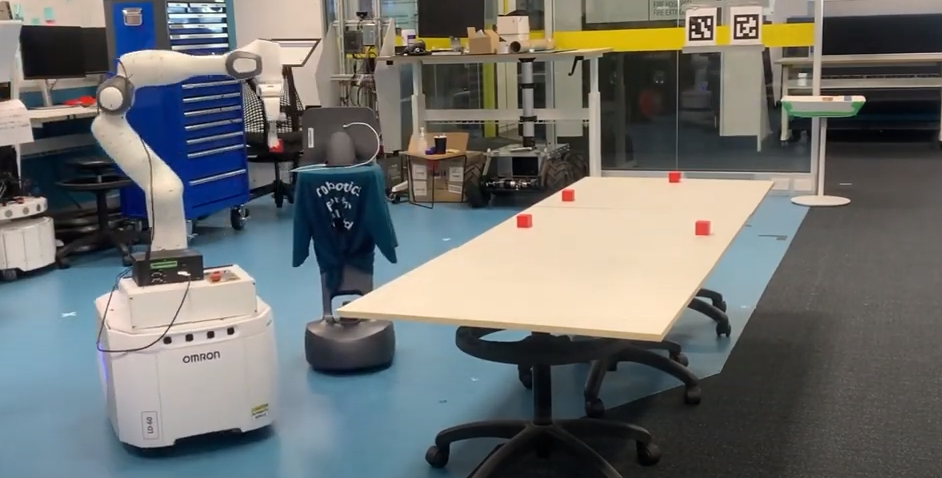
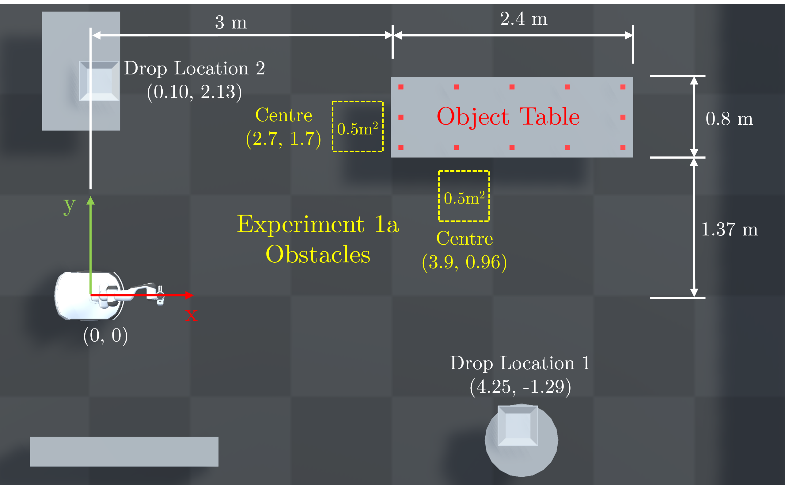
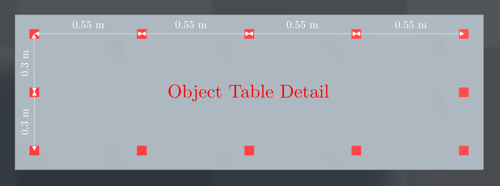

# Reactive Base Control for On-The-Move Mobile Manipulation in Dynamic Environments

We present a reactive base control method that enables high performance mobile manipulation on-the-move in environments with static and dynamic obstacles. We demonstrate the systems performane in numerous real-world and simulated environments where other robots in the workspace present dynamic obstacles. 

 

# Video

# Experiment Layout
The figures below illustrate the dimensions of the real-world and simulated experimental arrangement. 
 
 

# Related Projects
[Manipulation On-The-Move](https://benburgesslimerick.github.io/ManipulationOnTheMove/)
[Failure Recovery for Manipulation On-The-Move](https://benburgesslimerick.github.io/MotM-FailureRecovery/)
[Holisitic Mobile Manipulation](https://jhavl.github.io/holistic/)
[Robotics Toolbox for Python](https://github.com/petercorke/robotics-toolbox-python)
